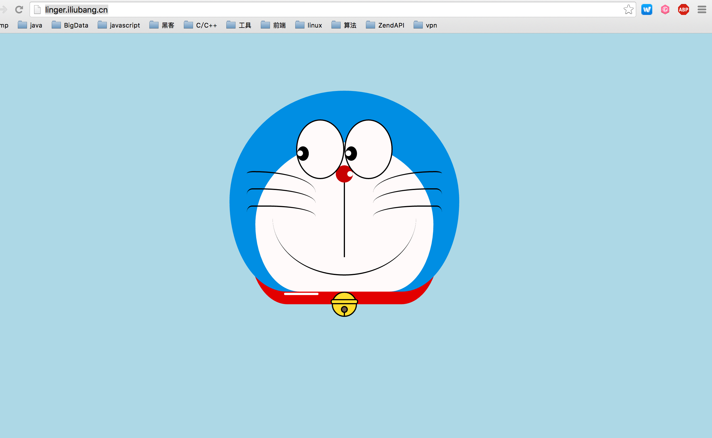

# simple php frame

```
     _
 ___/__) ,
(, /      __   _    _  __
  /    _(_/ (_(_/__(/_/ (_
 (_____      .-/
        )   (_/
```

## 简介

3月下旬，回到木铎智汇网络工作室，应大家的要求写一个php框架，来说明php框架的运行原理。
于是，此框架便诞生了。
这就是一个简单的php框架.【仅仅用来教学用】,帮助大家深入理解php框架的原理.
不喜勿喷！

**说明文档** [document](doc/README.md)

## 使用

### 使用内置命令行工具快速初始化项目

```
cd Linger
chmod a+x linger
./linger --app_name=app

```

### nginx配置

```
server {
    listen          80;
    server_name     your_server_name;
    root            your_project_root/public;
    index           index.php index.html;
    access_log      your_access_log_path  main;
    error_log       your_error_log_path;
    location ~ \.php$ {
        fastcgi_pass   127.0.0.1:9056;
        include        fastcgi.conf;
    }

    if (!-e $request_filename) {
        rewrite     ^/(.*)$     /index.php	last;
    }
}

```

### 打开浏览器就可以看到下面的界面




